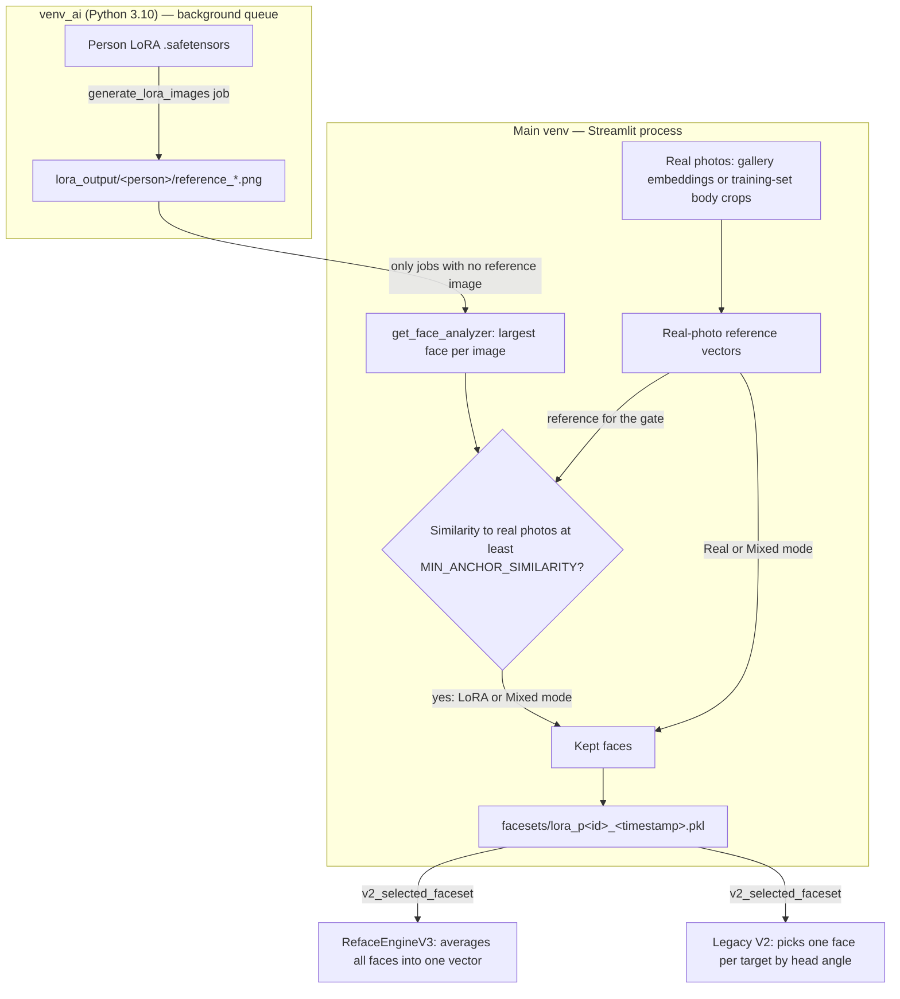

# LoRA Identity Source for Reface V2 (Design Document)

**Date**: 2026-09-17
**Status**: Draft — blocked on the Phase 0 go/no-go (§2)
**Target surface**: `the app/dashboard.py` (Reface V2 → Quick Swap → Step 1, and the Character LoRA Generate tab), new `the app/lora_identity.py`, `the app/lora_generate_job.py`
**Deliberately unchanged**: `identity.py`, `reface_engine.py`, `reface_engine_v2.py`, `reface_engine_v3.py`, `job_manager.py`

---

## 1. Problem and hypothesis

The swap model (inswapper) reads exactly one thing from the source: a 512-d InsightFace `normed_embedding`. V3 builds that vector by quality-weighted averaging over every face in the selected faceset (`identity.build_source_from_faceset`, called in `reface_engine_v3.py`). Lighting, sharpness and expression in the source photos matter only to the extent they move that vector.

Every person with a trained Character LoRA already has real photos of themselves on disk. `lora_dataset.py` refuses to build a training set below `MIN_IMAGES_BLOCK = 5` images and warns below 15. So "the user has only 1–2 photos" is not the case this feature serves.

The actual question is:

> Does an identity vector averaged from LoRA-generated portraits match the real person better than one averaged from the real photos the LoRA was trained on?

Reasons it might: the real set contains blur, occlusion, extreme angles and restoration artifacts, and the LoRA may have learned the stable identity underneath them.
Reasons it might not: the LoRA reproduces the person approximately, every generated image shares that same approximation, and averaging many of them removes random noise but keeps the systematic error.

Nobody has measured this, so the feature is built in two steps: measure first (Phase 0), then build the UI in whatever shape the numbers support.

---

## 2. Phase 0 — measure before building (go/no-go)

### Prerequisites
- A person with a trained LoRA *and* a training dataset. Today that is only `aya_selim` (`models/loras/aya_selim.safetensors`, `lora_datasets/aya_selim/`). One person is a thin sample; add more before a final decision if possible.
- At least 8 **plain** generations for that person: Character LoRA → 3) Generate, default prompt, **no reference image**, 8 images.

### Script: `the app/compare_lora_identity.py`
```
venv\Scripts\python.exe compare_lora_identity.py <person_id> <target_image> [<target_image> ...]
```
Built on `lora_identity.py` (§4), so Phase 0 exercises the same code the UI will use.

1. Load the person's real-photo vectors (§4.1) and split them into two halves by index, A and B.
2. Load the clean generated-portrait vectors (§4.2).
3. For each fold (build on A and score on B, then the reverse):
   - **Real** faceset = build half. **LoRA** faceset = all generated faces. **Mixed** = build half + generated faces.
   - Build each identity vector with `identity.build_identity_embedding`, the same function V3 uses.
   - **Vector score** = cosine similarity to the unit-norm mean of the held-out half.
   - For each target image, swap with `RefaceEngineV3` (default settings) using each faceset, detect the face in the output, and record **output score** = cosine similarity to the held-out mean.
4. Print per-candidate vector and output scores for both folds, plus:
   - each generated face's similarity to the real-photo mean (shows how spread out the LoRA's faces are)
   - the lowest-scoring real photos (gallery clustering can put the wrong face into a person; these are what to inspect)
   - the **10th-percentile real-photo similarity to the held-out mean** — this is the proposed `MIN_ANCHOR_SIMILARITY` (§4.3)
5. Write `reface_output/compare_lora_identity_<timestamp>.png`: one row per target image, columns Real / LoRA / Mixed.

Each half holds only about 50% of the real photos, so the **Real** candidate is slightly handicapped compared with production use. If Real still wins, that result is solid.

### Decision
- **Go (LoRA or Mixed):** that candidate beats Real on vector score in *both* folds by ≥ 0.02 (proposed margin), and the side-by-side is judged no worse by eye. Ship §3–§7 with the winning mode as the default.
- **No-go:** ship the cheaper version — the same "🧬 Trained LoRA" source mode, but built from the real training photos only, with no generation controls. It is still a one-click shortcut from a trained person to a swap identity.

Record the numbers and the decision in this section before starting Phase 1.

---

## 3. How it plugs in

The feature's only output is an ordinary `Faceset` pickle in `facesets/`. After that, both swap paths take over unchanged:

- The foreground path loads it through `engine.load_faceset_by_name(...)`.
- The background path passes `faceset_name` in the job params, and `job_manager.run_single_job` loads it when the job starts.



Legacy V2 does **not** use the averaged vector. It matches each target face to the single source face with the closest head angle (`Faceset.get_best_match`). Generated portraits are all frontal (the default prompt is front view, and its negative prompt excludes side view), so Legacy V2 gains nothing from angle matching here. It still works.

---

## 4. Data sources and filtering (`lora_identity.py`)

Runs in the main venv. Uses no torch and loads no models itself: the caller passes in a face analyzer, which the dashboard gets from `get_face_analyzer()`.

### 4.1 Real-photo reference vectors — `real_photo_embeddings(person_id, person_name, face_app)`
Tried in order; the first source that returns any faces wins:
1. **Gallery faces:** `database.get_faces_by_person(person_id)` records that have an `embedding`. No detection is needed; `quality_score` becomes the weight.
2. **Training set:** `lora_datasets/<_slugify(person_name)>/*person/*_body.jpg`, detected with `face_app` (largest face). Use the body crops, not `*_face.jpg`. Face crops are cut tight to the bounding box, which detects poorly, and they were CodeFormer-restored when quality was below 0.6, which shifts identity. Body crops are untouched pixels with margin around the face. This is the same `lora_datasets/<slug>` lookup the Train tab uses.

If both are empty, generated faces can't be checked against the real person, so LoRA mode is blocked for that person with a message saying why (§6).

### 4.2 Clean generated portraits — `clean_generated_images(person_name, jobs_manager)`
- Scan `lora_generate_job.generation_output_dir(person_name)` for `reference_<job_id>_<NN>_seed<seed>.png`.
- Load `jobs/<job_id>.json`. **Keep the image only if the job exists and its params have no `reference_image`.** With a reference image, image-to-image keeps much of the reference's face shape, and IP-Adapter copies the reference's face (the Generate tab's own help text warns about this above ~0.6). Those images may show someone else's identity.
- If the job record is missing, exclude the image: there's no way to prove it's clean.
- Return `(kept_paths, excluded)`, where `excluded` is a list of `(path, reason)` for the UI.

### 4.3 Per-face gate — `filter_by_anchor(detections, anchor, min_similarity)` (pure)
- `anchor` = quality-weighted unit mean of the real-photo vectors.
- Drop a generated face if its cosine similarity to `anchor` is below `MIN_ANCHOR_SIMILARITY`.
- `MIN_ANCHOR_SIMILARITY` is a module constant taken from Phase 0: the 10th-percentile real-photo similarity. In words, a generated face must look at least as much like the person as a weak real photo does. Don't borrow the gallery's 0.35 clustering distance without checking it; it was tuned for a different job.
- Returns `(kept, dropped)`; each dropped entry carries its similarity score for the report.

### 4.4 Building the faceset — `faceset_from_detections(name, detections)` (pure)
- Build `FaceData` directly. Don't use `RefaceEngine.build_faceset_from_media`: it creates a stray `facesets/<name>/` folder and takes `faces[0]` instead of the largest face.
- Match the fields that existing facesets use: `embedding` = the raw `face.embedding`, `quality` = `det_score` (gallery faces use `quality_score`), `pose` from `face.pose`, `bbox` as a list, `image_path` = the source file (used only for previews; both engines read the stored embedding).

### 4.5 Orchestration — `build_lora_faceset(person, mode, selected_paths, face_app, jobs_manager) -> (faceset | None, report)`
- `mode` ∈ `real`, `lora`, `mixed`.
- `report` holds counts and reasons, for example: *"Kept 6 of 8 portraits — 1 had no face, 1 below similarity (0.41). Identity vs real photos: 0.71."*
- Returns `None` with the reason in `report` when no faces survive.

### 4.6 Naming
- The name is `lora_p<person_id>_<YYYYmmdd_HHMMSS>`, and every activation writes a **new** file.
- Background jobs look up `faceset_name` when they *start*. Overwriting a fixed name would silently change the identity of jobs already in the queue.
- Using the person id instead of a name slug also avoids collisions between persons whose names slugify the same.
- The existing "📦 Use Faceset" list shows every version. LoRA mode shows only the newest file per person. Cleanup of old versions is out of scope (§9).

---

## 5. Shared generation parameters (`lora_generate_job.py`)

The Generate tab builds the `generate_lora_images` job params inline in `dashboard.py`. Move that into one helper so both pages queue identical jobs:

```python
def build_generation_params(person, lora_info, num_images, seed=-1, prompt=None,
                            negative_prompt=None, reference_params=None) -> dict
```
- It fills `person_id`, `person_name`, `base_checkpoint` (`models/sd15_realistic_base.safetensors`), `lora_path`, `trigger_word`, `prompt` (defaults to `DEFAULT_PROMPT_TEMPLATE`), `negative_prompt`, `num_images`, `seed`, `steps=DEFAULT_STEPS`, and `output_dir=generation_output_dir(...)`.
- It also returns the same "problems" list the tab shows today (venv_ai missing, LoRA file missing, checkpoint missing), so both callers can disable their buttons the same way.
- The Generate tab switches to the helper with no behavior change.

---

## 6. UI — Reface V2 → 🔄 Quick Swap → Step 1

Extend the radio with key `v2_source_mode`:
```python
source_mode = st.radio("Source Mode", ["📤 Upload New", "📦 Use Faceset", "🧬 Trained LoRA"],
                       horizontal=True, key="v2_source_mode")
```

When **🧬 Trained LoRA** is selected:

1. **Person.** A selectbox of persons where `get_person_lora_info(id)["lora_path"]` is set (the same filter the Generate tab uses).
   - No such persons: an info message, plus a "🧬 Open Character LoRA" button that calls `navigate_to("🧬 Character LoRA")`.
   - The LoRA file is missing from disk: a warning plus the same button. Only generation is disabled; portraits already on disk and real photos still work.
   - No real photos found (§4.1): an error explaining that generated faces can't be checked, and the rest of the section is hidden.
2. **Identity from.** A radio: Real photos / LoRA portraits / Both. The default is the Phase 0 winner. On a no-go, this control and steps 3–4 are removed and the mode is always Real.
3. **Portraits.** A thumbnail grid of clean generated images (§4.2), each with a checkbox, all ticked by default. Excluded images appear in a collapsed expander with their reason.
4. **Generate.** A "🎨 Generate 8 portraits" button queues `generate_lora_images` via `build_generation_params` (default prompt, no reference image). It is disabled when the helper reports problems.
   - While the job is queued or running, a small `st.fragment(run_every=2)` shows `job.message`, or *"Waiting for job X (type) to finish"* when another job holds the queue. This is the same polling pattern as the Generate tab: poll only while a live worker has the job queued or running, and rerun once it finishes so the grid refreshes.
5. **✅ Use This LoRA Identity.**
   - Calls `build_lora_faceset` with `get_face_analyzer()` and shows the report.
   - 0 faces kept: error, nothing saved.
   - 1–2 faces kept: a warning, but the faceset is still saved.
   - On success: saves the pickle, sets `st.session_state['v2_selected_faceset']` to the new name and `v2_data_source_mode` to `'faceset'`. Everything downstream (the has-source check, foreground and background runs) already handles that.

---

## 7. GPU contention

A foreground swap runs in the Streamlit process, while queue jobs run in the worker. Nothing stops both from using the GPU at once. That risk exists today; this feature makes it more likely because it queues a generation job from the same page where you swap.

- Add a helper `gpu_heavy_job_running(manager)` that returns the running job when the worker is alive and the job type is in `GPU_HEAVY_JOB_TYPES = {"generate_lora_images", "train_lora", "undress_image"}`.
- While it returns a job, disable **✅ Use This LoRA Identity** and **🚀 Process with V2 Engine** (unless "Run in Background" is ticked, which just queues behind the job). Show a caption naming the job.
- This applies to **all** Reface V2 source modes. That is a small, intended behavior change for the existing modes.

---

## 8. Errors and edge cases

| Situation | Behavior |
|---|---|
| No persons with a LoRA | Info message + button to the Character LoRA page |
| LoRA file deleted | Warning + button; generation disabled, existing portraits and real photos still usable |
| No real photos found for the person | LoRA mode blocked with the reason (generated faces can't be checked) |
| Portrait from a job that used a reference image, or whose job record is gone | Excluded, listed with its reason |
| No face detected / below `MIN_ANCHOR_SIMILARITY` | Dropped, counted in the report with the score |
| 0 faces kept | Error, nothing saved |
| venv_ai / base checkpoint missing | Generate disabled, same messages as the Generate tab |
| Another job holds the queue | Status line says what it's waiting for |
| GPU-heavy job running | Foreground swap and identity build disabled (§7) |
| Faceset re-activated while a swap job is queued | New file; the queued job keeps its original identity |

---

## 9. Out of scope

- Angled portraits. They only help Legacy V2's angle matching, and the default prompt is frontal by design.
- Deleting old `lora_p*` faceset versions.
- GPU gating on pages other than Reface V2.
- Changing the swap engines or `identity.py`.

---

## 10. Verification

### Automated — `the app/test_lora_identity.py`
Follows the repo's convention: a standalone script, no GPU or models, prints results, `exit(1)` on failure, and can filter by test name like `test_compositor.py`.

- **Round trip:** `faceset_from_detections` on random non-unit 512-d vectors → `Faceset.save` to a temp dir → `Faceset.load` → `build_source_from_faceset` gives shape `(512,)` with norm 1 (tolerance 1e-5), and fields survive (quality, bbox, pose).
- **Similarity gate:** vectors built with known cosine similarity to the anchor are split at the threshold, and dropped entries carry their scores.
- **Clean-image filter:** a temp output dir with fake `reference_<id>_NN_seed<s>.png` files and a temp `JobManager` holding one job with `reference_image`, one without, and one id with no record. Only the clean job's images are kept, with the right reasons for the rest.
- **Real-photo source order:** a stub database with embeddings takes priority over dataset body crops; with neither, the result is empty.
- **Empty/invalid input:** a stub `face_app` that finds no faces, plus unreadable paths, gives `(None, report)` with reasons and no exception.
- **Naming:** two builds for the same person produce different file names.

### Phase 0
Run `compare_lora_identity.py`, then paste the scores, the chosen `MIN_ANCHOR_SIMILARITY`, and the go/no-go decision into §2.

### Manual
Test on a second Streamlit port so a running background job isn't killed (the queue worker is a child of Streamlit, and module edits need a restart). From `the app/`: `venv\Scripts\streamlit run dashboard.py --server.port 8502`.

1. Reface V2 → 🧬 Trained LoRA → `aya_selim`. Portraits appear. Generate one extra image **with** a reference image on the Character LoRA page and confirm it shows up under Excluded.
2. Click 🎨 Generate. The status line updates, and the grid refreshes when the job finishes.
3. Click ✅ Use This LoRA Identity. The report shows kept/dropped counts, and the new `lora_p<id>_…` faceset also appears under 📦 Use Faceset.
4. Queue a background V3 swap, re-activate the identity, and confirm the queued job still names the older faceset file.
5. While a generation job runs, confirm 🚀 Process is disabled unless Run in Background is ticked.
6. Swap one image with ✨ HD V3 and with Legacy V2, then compare against the Phase 0 side-by-side.
